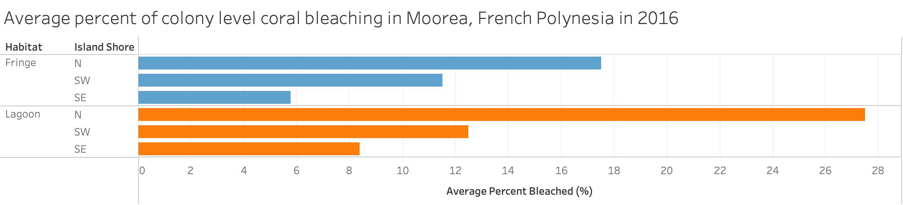
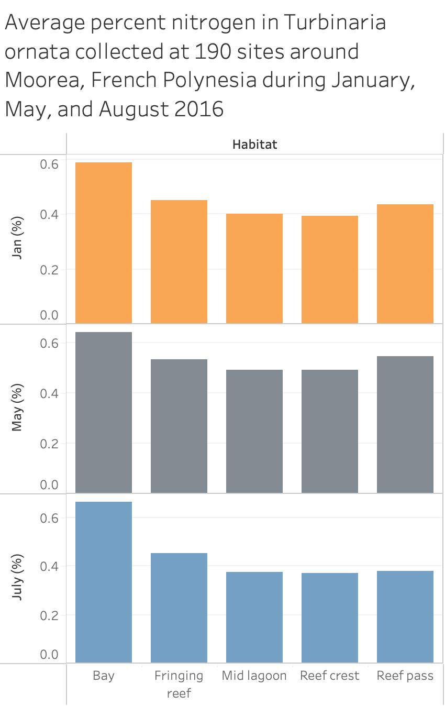

```{r setup, include=FALSE}
knitr::opts_chunk$set(echo = TRUE)
```

# Data Visualization Assignment 

Currently in the MEDS program, I am taking EDS240 Data Visualization and Communication. Our second assignment was to create two data visualizations using Tableau, which is a data visualization and business intelligence tool used for reporting and analyzing data. For this post, I want to compare my data visualizations in Tableau versus RStudio and determine which one communicated my data better. 


# Loading the data 

I will use the `librarian` package to load packages automatically at the start of my R session. I use the `here` package to easily build paths to my data file and use `tidyverse`, which is an amazing collection of open source R packages for data science. I also explore the `naniar` package to investigate missing data structures. Finally, I use `RColorBrewer`, which is an R package that uses the work from http://colorbrewer2.org/ to help you choose sensible color schemes for figures in R. The colors are split into three group, sequential, diverging, and qualitative.  

```{r}
# Load packages
librarian::shelf(here, tidyverse, naniar, RColorBrewer)

```

```{r}
# Here is some of the notation I will be using in my file paths to read in the data:

# .    = this directory
# ..   = the parent directory
# ../  = the parent directory
# ~/   = the user's home directory or the application's, in ASP
# /    = the root directory

# ../../ = the parent's parent directory
```
 
```{r}
# Read in data
# Includes nitrogen content and coral bleaching data collected from the Moorea Coral Reef Long Term Ecological Research (MCR LTER) site.
MCR_LTER_bleaching_data <- read.csv(here("../data/MCR_LTER_Burkepile_Adams_2016_Coral_Bleaching_Survey_20191023.csv"))

MCR_LTER_Nitrogen_data <- read.csv(here("../data/MCR_LTER_Adam_EcolAp_N_summary_20200331.csv"))

```

# Investigating the data

First, let's check out the missing data values in the MCR-LTER bleaching data using the `naniar` package, which provides useful functions for examining initial missing value counts and proportions. 

```{r}
# Returns NA count in your data frame or column
n_miss(MCR_LTER_bleaching_data)

# Returns number of complete values
n_complete(MCR_LTER_bleaching_data)

# Proportion or percentage of values that are NA
prop_miss(MCR_LTER_bleaching_data) 

pct_miss(MCR_LTER_bleaching_data)

# A summary table of NA counts in your table
miss_var_summary(MCR_LTER_bleaching_data)

# A summary table of NAs by case (observation)
miss_case_table(MCR_LTER_bleaching_data)
```

The summary table of NA counts in the data show us that there are 20 NA values in the  Percent_bleached column, which is 0.1955034% of the values in that column. Knowing this, we can safely remove these NA values from the Percent_bleached column. 

```{r}
# Remove NA values 
MCR_LTER_bleaching_data_clean <- MCR_LTER_bleaching_data[!is.na(MCR_LTER_bleaching_data$Percent_bleached), ]

# Confirm that NA's were removed from Percent_bleached column
pct_miss(MCR_LTER_bleaching_data_clean$Percent_bleached)
```

Next, let's check out the missing data values in the MCR-LTER nitrogen summary data. 

```{r}
# Returns NA count in your data frame or column
n_miss(MCR_LTER_Nitrogen_data)

# Returns number of complete values
n_complete(MCR_LTER_Nitrogen_data)

# Proportion or percentage of values that are NA
prop_miss(MCR_LTER_Nitrogen_data) 

pct_miss(MCR_LTER_Nitrogen_data)

# A summary table of NA counts in your table
miss_var_summary(MCR_LTER_Nitrogen_data)

# A summary table of NAs by case (observation)
miss_case_table(MCR_LTER_Nitrogen_data)
```

The summary table of NA counts in the Nitrogen data show us that there are:

19 NA values in the Percent_N_May column, which is 10% of the values in that column
17 NA values in the Percent_N_July column, which is 8.94% of the values in that column
6 NA values in the Percent_N_Jan column, which is 3.15% of the values in that column

Knowing this, we can safely remove these NA values from each of these columns.

```{r}
# Remove NA values 
MCR_LTER_Nitrogen_data_clean <- 
  MCR_LTER_Nitrogen_data[!is.na(MCR_LTER_Nitrogen_data$Percent_N_May) &            !is.na(MCR_LTER_Nitrogen_data$Percent_N_Jan) &
!is.na(MCR_LTER_Nitrogen_data$Percent_N_July),]

# Confirm that NA's were removed from each column
pct_miss(MCR_LTER_Nitrogen_data_clean$Percent_N_May)

# Confirm that NA's were removed from each column
pct_miss(MCR_LTER_Nitrogen_data_clean$Percent_N_Jan)

# Confirm that NA's were removed from each column
pct_miss(MCR_LTER_Nitrogen_data_clean$Percent_N_July)

```

# Wrangling the data 

Here I will find the average percent of the colony area that was bleached for sites at each cardinal direction of shoreline (N, SE, SW) and for each species

```{r}
# Find the average percent of the colony area that was bleached for sites at each cardinal direction of shoreline (N, SE, SW) and for each species
avg_percent_bleached <- MCR_LTER_bleaching_data_clean %>%
  group_by(Habitat, Island_shore) %>% 
  summarise(Avg_percent_bleached = mean(Percent_bleached))

```

Next I will find the average percent nitrogen in Turbinaria ornata for each month and habitat type

```{r}
# Find the average percent nitrogen in Turbinaria ornata for each month 

# Average percent nitrogen for January 
avg_percent_N_jan <- MCR_LTER_Nitrogen_data_clean %>%
  group_by(Habitat) %>% 
  summarise(avg_percent_N = mean(Percent_N_Jan)) %>% 
  mutate(month = "January")

# Average percent nitrogen for May 
avg_percent_N_may <- MCR_LTER_Nitrogen_data_clean %>%
  group_by(Habitat) %>% 
  summarise(avg_percent_N = mean(Percent_N_May)) %>%
  mutate(month = "May")


# Average percent nitrogen for July
avg_percent_N_july <- MCR_LTER_Nitrogen_data_clean %>%
  group_by(Habitat) %>% 
  summarise(avg_percent_N = mean(Percent_N_July)) %>% 
  mutate(month = "July")


# Then, I will join the data frames together, starting with January and May. The full_join() retains all rows and all values
avg_percent_N_jan_may <- full_join(avg_percent_N_jan, avg_percent_N_may, by = c("Habitat", "avg_percent_N", "month"))

# Finally, I will join July to the data frame containing January and May observations with full_join() to get our final dataset for the average percent nitrogen in Turbinaria ornata for each month and habitat type.

avg_percent_N_complete <- full_join(avg_percent_N_jan_may, avg_percent_N_july, by = c("Habitat", "avg_percent_N", "month"))

# I will also order the "month" categories chronologically for easier plotting 
avg_percent_N_complete <- avg_percent_N_complete %>% 
mutate(month = factor(month, levels = c("January","May","July")))

print(avg_percent_N_complete)

```


# Visualizing the data

First I will visualize the coral bleaching data using a horizontal bar chart.

```{r}
# Plot the coral bleaching data and reorder 'Island_shore' by decreasing value of 'Avg_percent_bleached'
bleach_plot <- ggplot(data = avg_percent_bleached, aes(x = reorder(Island_shore, Avg_percent_bleached), 
                                        y = Avg_percent_bleached,
                                        fill = Habitat)) +
  geom_bar(stat = "identity", position = position_dodge()) +
  scale_fill_brewer(palette = "Paired") +
  labs(y = "Average Percent Bleached (%)", 
       x = "Island Shore", 
       title = "Average Percent of Colony Level Coral Bleaching
for Moorea, French Polynesia in 2016") + coord_flip() +
  theme_bw()

# View the plot
bleach_plot 
```

The main message of my this visualization is to communicate that: 
1) The average percent of colony level coral bleaching was highest overall in the Lagoon habitat.
2) The average percent of colony level coral bleaching decreased from highest to lowest on the North, Southwest, and Southeast shore respectively in Moorea, French Polynesia.

First, I want the audience to recognize that there are two habitat types (Fringe and Lagoon) that they will be comparing between, which is why I colored them in dark blue and light blue to increase their visual salience. Next, I want it to be easy for the audience to compare the average percent bleaching between the three sides of Moorea, which is why I used a horizontal bar chart because they are used often in data visualization and take relatively little effort to understand. 

I chose to align the bars in order of decreasing average percent bleached for each habitat type. This natural ordering allows the audience to easily compare the percent bleaching for different sides of the island. I also included the visual variable of color hue, specifically dark blue and light blue because they easily differentiate the two habitats from each other and are visually appealing.  

Compared to my visualization in R, I thought that my Tableau visualization did a good job of differentiating the big picture differences in average percent bleaching between the two habitat types. However, I believe my Tableau visualization didn't compare the average percent bleaching between island shores as well as my visualization in R. The bars for each island shore are not side by side, which makes it harder for the audience to determine which shoreline had the highest percent bleaching. Overall, I think that visualizing this data in R allowed me to better represent the data and create a more effective visualization for informing a wide audience. Also, unlike Tableau, RMarkdown allowed me to easily document how I created my visualizations, which promotes reproducibility. 




Next, I will visualize the average percent nitrogen in Turbinaria ornata around Moorea, French polynesia in January, May, and July 2016.

```{r}
# Plot the nitrogen concentration data and reorder 'Habitat' by decreasing value of 'avg_percent_N'
nitrogen_plot <- ggplot(data = avg_percent_N_complete, aes(x = month,
                                                           y = avg_percent_N,
                                                           fill = reorder(Habitat, -avg_percent_N))) +
  geom_bar(stat = "identity", position = position_dodge()) +
  labs(y = "Average Percent Nitrogen (%)", 
       x = "Month", 
       title = "Average Percent Nitrogen in Turbinaria ornata Collected at 190 Sites
around Moorea, French Polynesia during January, May, and August 2016") +
  theme_bw() +
  scale_fill_discrete(name = "Habitat")

# View the plot
nitrogen_plot
```


The main message of this visualization is to communicate that the average percent nitrogen in *Turbinaria ornata* was highest in the bay habitat of Moorea in January, May, and July and that the average percent nitrogen increased in all the habitats in May compared to January and July.

I used a vertical bar chart because they are a common data visualization and make it easy for the audience to quickly see which habitat has the greatest average percent nitrogen, which has the smallest, and see the incremental difference between habitats. A visual variable that I chose to include in my visualization is regular arrangement, in which the bars are aligned left to right in order of decreasing average percent nitrogen. This helps the audience know which way to read the information on the bar chart and allows them to easily compare the different habitat types. 

Compared to my visualization in R, I believe my Tableau visualization didn't compare the average percent bleaching between months as well as my visualization in R. Stacking the bar charts on top of each other makes it difficult for the audience to compare the average percent nitrogen between different months. However grouping the bars together for each month makes it much easier to visually compare the average percent nitrogen btween different habitats and months. 




# Final Thoughts on Visualizations in R vs. Tableau

Overall, I think that visualizing this data in R allowed me to better represent the data and create a more effective visualization for informing a broader audience. However, my lack of experience with using Tableau likely resulted in my bias towards R. I think Tableau is a great way to make quick visualizations for folks who are unfamiliar with coding, but I think a major benefit that Tableau lacks is reproducibility of your work. Unlike Tableau, RMarkdown allowed me to easily document how I created my visualizations, which allows the audience to reproduce my visualizations on their own. 


# EXTRA - Exporting the data for visualizing data in Tableau 

I created a .csv file of my coral bleaching and nitrogen content data so that I could visualize this data in Tableau. However, Tableau does have its own data prep software called 'Tableau prep'. (I commented out this code chunk because I don't want to make duplicates)
 
```{r}
# Use write.csv to Export the DataFrame

# write.csv(avg_percent_bleached,"/Users/charleshendrickson/Downloads/avg_percent_bleached.csv", row.names = FALSE)

# write.csv(avg_percent_N_complete,"/Users/charleshendrickson/Downloads/avg_percent_N.csv", row.names = FALSE)
```


